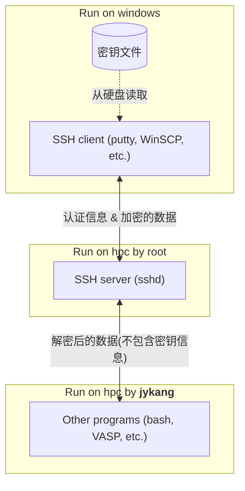
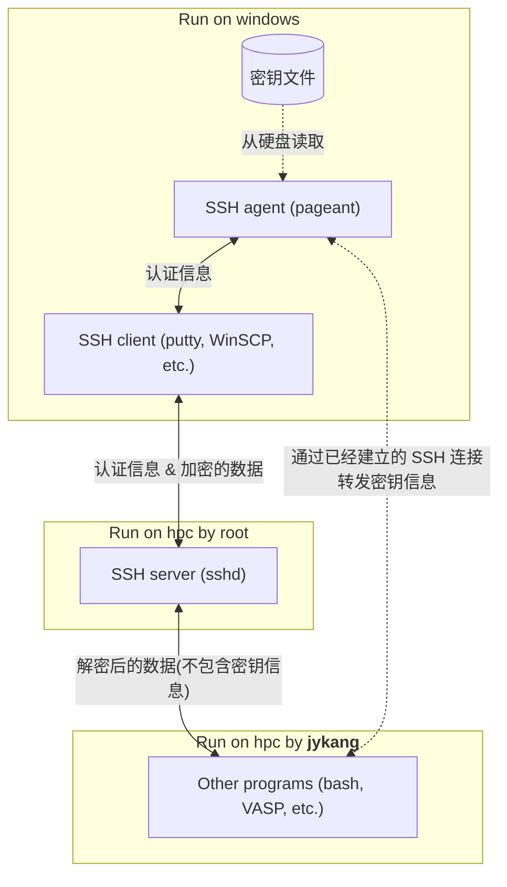

为了区分登陆 jykang@hpc.xmu.edu.cn 时使用的密钥，并分密钥统计使用情况，需要启用一项名为“SSH agent forwarding”的功能。
接下来的内容将带领您在 Windows 系统上配置 SSH agent forwarding。

要启用“SSH agent forwarding”，需要下面三个步骤：
1. 启动 Pageant 并添加密钥。**这一步骤每次登陆前都需要执行。**
2. 配置 PuTTY，使 PuTTY 在每次登陆时不直接使用密钥，而是利用 Pageant 完成认证。这一步骤只需要执行一次。
3. 配置 WinSCP，使 WinSCP 在每次登陆时不直接使用密钥，而是利用 Pageant 完成认证。这一步骤只需要执行一次。

接下来将分别说明这三个步骤。

**Pageant**:

1. 找到 Pageant 程序。Pageant 会随着 PuTTY 一起安装，一般来说您可以直接在开始菜单中搜索 “pageant” 找到它，也可以在 PuTTY 的安装目录中找到它。
2. 启动 Pageant。启动后可能没有任何反应，也可能有一个黑框闪过，这是正常的。只要右下角的系统托盘中出现了 pageant 的图标就可以了。
   
   

3. 双击 Pageant 图标，打开 Pageant 窗口。选择 “Add Key”，然后选择您的密钥文件。
   
   

4. 在使用服务器期间保持 Pageant 启动（可以关闭 Pageant 的窗口，但不要在系统托盘中右键退出）。
5. 使用完毕后，在系统托盘中右键退出 Pageant。

> [!TIP]
> 如果您觉得每次打开 Pageant 都要手动添加密钥很麻烦，并且熟悉 Windows 命令行的使用，
>   可以编写一个批处理文件（将下方代码用记事本保存，然后将扩展名从 `.txt` 改为 `.bat`），每次双击该文件即可启动 Pageant 并自动添加密钥：
> 
> `"C:\ProgramData\chocolatey\bin\PAGEANT.EXE" "Z:\.ssh\id_rsa.ppk"`
> 
> 其中第一个引号内为 Pageant 的路径，第二个引号内为您的密钥文件的路径。也可以将该批处理文件放入开机启动项中，使得 Pageant 在开机时自动启动。
> 
> 因为每个人的密钥文件以及 Pageant 的路径都可能不同，所以这里无法提供通用的批处理文件。

**PuTTY**:

1. 在 Connection -> SSH -> Auth，勾选“Attempt authentication using Pageant”和“Allow agent forwarding”。
   
   

2. 在 Connection -> SSH -> Auth -> Credentials，清空 “Private key file for authentication”，然后保存。
   
   

3. （选做但推荐）在 Connection -> Data 中，将 “Auto-login username” 设置为 `jykang`，这样每次登陆时就不需要手动输入用户名了。

**WinSCP**:

1. 在 SSH -> Authentication，勾选 “使用 Pageant 进行认证”，勾选 “允许代理转发”，清空 “密钥文件”，然后保存。
   
   

2. (选做)如果您需要通过 WinSCP 打开 PuTTY 的话，需要在 WinSCP 主界面 -> 工具 -> 选项 -> 集成 -> 应用程序路径中，
    在原来的基础上增加 `-A` 参数。
   
   

至此，您已经成功配置了 SSH agent forwarding。
之后使用 PuTTY 登陆 `jykang@hpc.xmu.edu.cn` 时，会收到包含了您的名字的提示（如图所示），表明您已经成功启用了 SSH agent forwarding。

   

之后的内容仅供有兴趣的用户参考，不建议小白用户尝试。

---

如果你好奇为什么不使用 Pageant 就无法区分使用不同密钥的登陆：

SSH 连接并不是直接由 jykang 用户处理的，
   而是由一个名为 `sshd` 的程序处理，它通常以 `root` 用户的身份运行。
在完成认证后，`sshd` 会将 Windows 电脑发来的信息解密后转发给以 `jykang` 用户运行的进程，
   并将以 `jykang` 用户运行的进程的输出加密后发回给 Windows 电脑。
我们只能控制 `jykang` 用户运行的进程，但这里拿不到任何关于密钥的信息。

Pageant 程序就是所谓的“SSH agent”。“SSH agent forwarding” 就是将到 Pageant 的连接通过已经建立的 SSH 连接转发给远程服务器，
   使得远程服务器可以与 Pageant 通信，进而读取密钥信息。
“SSH agent forwarding” 典型的用途是在远程服务器上使用本地的密钥再次登陆其他服务器，而不是为了区分使用不同密钥的登陆。

另外，如果您希望进一步区分使用同一个密钥的不同用户，可以修改 `TERM` 变量，加上 `hpcstat_subaccount:your_name:` 前缀。
对于 PuTTY 来说，`TERM` 变量在 Connection -> Data -> Ternimal-type string 中修改。
例如，如果原本的 `TERM` 变量是 `xterm`，那么修改后的 `TERM` 变量可以是 `hpcstat_subaccount:chn:xterm`。
`TERM` 变量只在交互式登陆时有效，因此无法在 WinSCP 中使用。
同时，这个修改也只是为了方便使用，统计出的结果不保证正确
   （如果 A 和 B 都使用同一个密钥登陆，那么显然 B 可以在 TERM 中填入 A 的名字以假装自己是 A）。

> [!WARNING]
> 不正确地修改 `TERM` 变量会导致一些程序无法正常工作，尝试时应该仔细且小心。这也是不建议小白用户尝试的原因。

如果您希望在登陆时自动跳转到自己的目录下，可以在 `TERM` 中再增加以下前缀：`chn_cd:your_path:`。
例如，将 `TERM` 变量修改为 `chn_cd:linwei/chn:xterm`，那么使用 PuTTY 登陆后会自动跳转到 `linwei/chn` 目录下。
如果同时使用了 `hpcstat_subaccount` 和 `chn_cd`，那么 `hpcstat_subaccount` 必须在 `chn_cd` 之后。
