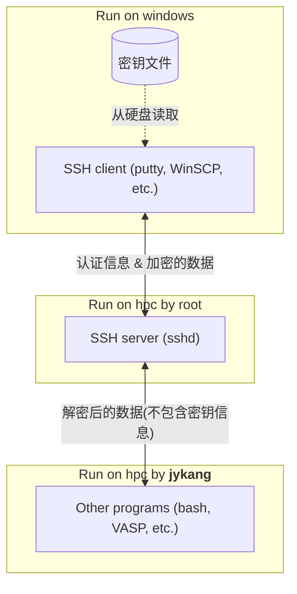
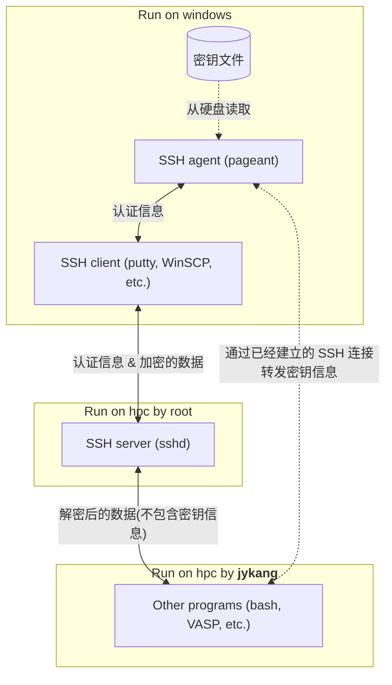

# 设置 SSH agent forwarding

为了区分登陆 jykang@hpc.xmu.edu.cn 时使用的密钥，并分密钥统计使用情况，需要启用一项名为“SSH agent forwarding”的功能。
接下来的内容将带领您在 Windows 系统上启用 SSH agent forwarding。

> [!NOTE]
> 在 Linux 和 MacOS 上启用 SSH agent forwarding 的方法放在了文章末尾，大多数用户不需要阅读，仅供有需要的用户参考。

要启用“SSH agent forwarding”，需要下面三个步骤：
1. 启动 Pageant 并添加密钥。 **这一步骤每次登陆前都需要执行。**
2. 配置 PuTTY，使 PuTTY 在每次登陆时不直接使用密钥，而是利用 Pageant 完成认证。这一步骤只需要执行一次。
3. 配置 WinSCP，使 WinSCP 在每次登陆时不直接使用密钥，而是利用 Pageant 完成认证。这一步骤只需要执行一次。

接下来将分别说明这三个步骤。

## Pageant:

1. 找到 Pageant 程序。
   Pageant 会随着 PuTTY 一起安装，一般来说您可以直接在开始菜单中搜索 “pageant” 找到它，也可以在 PuTTY 的安装目录中找到它。
   
   

2. 启动 Pageant。启动后可能没有任何反应，也可能有一个黑框闪过，这是正常的。只要右下角的系统托盘中出现了 pageant 的图标就可以了。
   
   

3. 双击 Pageant 图标，打开 Pageant 窗口。选择 “Add Key”，然后选择您的密钥文件。
   
   

4. 在使用服务器期间保持 Pageant 启动（可以关闭 Pageant 的窗口，但不要在系统托盘中右键退出）。
5. 使用完毕后，在系统托盘中右键退出 Pageant。

> [!NOTE]
> 无论是使用 WinSCP 还是 PuTTY，每次使用前，都需要如此启动 Pageant 并添加密钥。

> [!TIP]
> 如果您觉得每次打开 Pageant 都要手动添加密钥很麻烦，希望可以将这个过程自动化；并且熟悉 Windows 命令行的使用，可以编写一个批处理文件。
> 将下方代码用记事本保存，然后将扩展名从 `.txt` 改为 `.bat`，之后每次双击该文件即可启动 Pageant 并自动添加密钥：
> 
> `"C:\ProgramData\chocolatey\bin\PAGEANT.EXE" "Z:\.ssh\id_rsa.ppk"`
> 
> 其中第一个引号内为 Pageant 的路径，第二个引号内为您的密钥文件的路径。也可以将该批处理文件放入开机启动项中，使得 Pageant 在开机时自动启动。
> 
> 因为每个人的密钥文件以及 Pageant 的路径都可能不同，所以这里无法提供通用的批处理文件。

## PuTTY:

1. 在 Session 中设置 “Host Name (or IP address)” 为 `hpc.xmu.edu.cn`，“Port” 为 `22`。
   
   

2. 在 Connection -> SSH -> Auth，勾选“Attempt authentication using Pageant”和“Allow agent forwarding”。
   
   

3. 在 Connection -> SSH -> Auth -> Credentials，清空 “Private key file for authentication”。
   
   

4. （选做但推荐）在 Connection -> Data 中，将 “Auto-login username” 设置为 `jykang`，这样每次登陆时就不需要手动输入用户名了。
5. 回到 Session，在 “Saved Sessions” 中输入任意一个名字（例如 `jykang`）并点击 “Save”，以保存配置。之后双击这个配置文件的名字即可登陆。
   
   

## WinSCP:

1. 在登陆界面，点击 “新建站点”。
   设置 “文件协议” 为 `SCP`，“主机名” 为 `hpc.xmu.edu.cn`，“端口号” 为 `22`，“用户名” 为 `jykang`，密码为空。
   然后点击右下角 “高级” 继续修改设置。
   
   

> [!NOTE]
> 文件协议设置为 “SFTP” 大多功能也可以使用，但相比于 SCP 协议，SFTP 可用的功能较少（例如不能远程复制）。因此建议使用 SCP。

2. 在 SSH -> Authentication，勾选 “使用 Pageant 进行认证”，勾选 “允许代理转发”，清空 “密钥文件”，然后点击 “确定”，再点击 “保存”。
   
   

3. (选做)如果您需要通过 WinSCP 打开 PuTTY 的话，需要在 WinSCP 主界面 -> 工具 -> 选项 -> 集成 -> 应用程序路径中，
      在原来的基础上增加 `-A` 参数。
   
   

> [!TIP]
> 如果难以直接在文本框中修改，就把它复制到记事本里修改，然后再复制回去。

至此，您已经成功配置了 SSH agent forwarding。
之后使用 PuTTY 登陆 `jykang@hpc.xmu.edu.cn` 时，会收到包含了您的名字的提示（如图所示），表明您已经成功启用了 SSH agent forwarding。

   

> [!NOTE]
> 如果您确认已经按照教程设置好了却仍然不能连接，可以尝试将 WinSCP 和 PuTTY 都更新到最新。已知非常旧的版本在设置过程中会出现问题。
>
> 我测试使用的版本是：PuTTY 0.78 和 WinSCP 6.3.3。

---

# 其它内容

接下来的内容不是使用 jykang@hpc.xmu.edu.cn 的必需内容，不须要阅读。
如果您按照上面的步骤配置 SSH agent forwarding 失败，那么请再次仔细阅读上面的内容，**接下来的内容对您没有帮助**。

接下来的内容包括：
* 解释为什么不转发 agent 就无法区分不同密钥。
* 介绍一些可能有用的附加功能，例如区分使用同一个密钥的不同用户，以及如何设置任务进度微信通知。

## 为什么不转发 agent 就无法区分不同密钥？

如果你好奇为什么不使用 Pageant 就无法区分使用不同密钥的登陆：

SSH 连接并不是直接由 jykang 用户处理的，
   而是由一个名为 `sshd` 的程序处理，它通常以 `root` 用户的身份运行。
在完成认证后，`sshd` 会将 Windows 电脑发来的信息解密后转发给以 `jykang` 用户运行的进程，
   并将以 `jykang` 用户运行的进程的输出加密后发回给 Windows 电脑。
我们只能控制 `jykang` 用户运行的进程，但这里拿不到任何关于密钥的信息。



Pageant 程序就是所谓的“SSH agent”。“SSH agent forwarding” 就是将到 Pageant 的连接通过已经建立的 SSH 连接转发给远程服务器，
   使得远程服务器可以与 Pageant 通信，进而读取密钥信息。
“SSH agent forwarding” 典型的用途是在远程服务器上使用本地的密钥再次登陆其他服务器，而不是为了区分使用不同密钥的登陆。



事实上，linux 的管理（统计用户使用的资源，等）非常依赖于不同的用户，即用高权限的用户去管理低权限的用户。
大家都使用同一个账户的情况下，很多管理的功能没有现成的解决方案（要自己手写代码、思考如何设计），甚至完全无法实现。
整这个东西真的挺麻烦的。我也嫌麻烦（而且我要做的事情比大多数用户多得多）。要不是康老师一定要我做，我才不会做。
如果你嫌这些麻烦，与其埋怨我，不如去建议自己的导师去自己申请一个账号用。

## 设置子账户:

一个老师拿到密钥后，可能会将它分发给多个不同的学生。
如果希望区分不同学生的使用情况，可以修改 `TERM` 变量，加上 `hpcstat_subaccount:your_name:` 前缀，
   以此来进一步区分使用同一个密钥的不同用户。

对于 PuTTY 来说，`TERM` 变量在 Connection -> Data -> Ternimal-type string 中修改。
例如，如果原本的 `TERM` 变量是 `xterm`，那么修改后的 `TERM` 变量可以是 `hpcstat_subaccount:chn:xterm`。
`TERM` 变量只在交互式登陆时有效，因此无法在 WinSCP 中使用。

如果设置了这个参数，那么会额外统计不同子账户的使用情况（登陆次数、投递的任务、占用的核时，等）。
是否设置这个参数都不影响按密钥统计的功能（即，按照密钥统计的核时，是所有使用这个密钥的用户的总和，无论是否设置了这个参数）。

同时，子账户的统计结果也仅供参考，事实上这个统计结果很容易造假
   （如果 A 和 B 都使用同一个密钥登陆，那么显然 B 可以在 TERM 中填入 A 的名字以假装自己是 A，把自己用的核时都算到 A 头上）。

> [!CAUTION]
> 如果 `TERM` 变量的格式设置得不正确，PuTTY 登陆后一些程序会无法正常工作，因此尝试时应该仔细且小心。

## PuTTY 登陆时自动跳转:

如果您希望在登陆时自动跳转到自己的目录下，可以在 `TERM` 中再增加以下前缀：`chn_cd:your_path:`。

例如，将 `TERM` 变量修改为 `chn_cd:linwei/chn:xterm`，那么使用 PuTTY 登陆后会自动跳转到 `linwei/chn` 目录下。

如果同时使用了 `hpcstat_subaccount` 和 `chn_cd`，那么 `hpcstat_subaccount` 必须在 `chn_cd` 之后，
   例如 `chn_cd:linwei/chn:hpcstat_subaccount:chn:xterm`。

## 任务进度微信通知:

用微信打开下面的链接：

```
https://wxpusher.zjiecode.com/wxuser/?type=1&id=75864#/follow
```

您应该会被引导去关注一个公众号（WxPusher 消息推送平台）。关注这个公众号之后会收到一条包含 UID 的消息。
然后把下面的信息发给我：
* 您的 UID
* 您使用的密钥的指纹（用 PuTTY 登陆时会提示）
* 如果使用了子账户（在 `TERM` 中设置了 `hpcstat_subaccount`），还需要告诉我您设置的子账户名

之后您投递的任务有新进度（例如，开始运行、运行结束）时就会通过这个公众号收到通知。

需要注意的是，这个 UID 会被明文写到 jykang 上的文件里。
也就是说存在这样的风险：有权限登陆 jykang 的人都有权限通过这个公众号给您发消息。

## 在类 UNIX 系统上配置 SSH agent forwarding

1. 使用以下命令将 `.ppk` 的私钥部分拆分出来：

   ```bash
   puttygen id_rsa.ppk -O private-openssh -o ./id_rsa
   ```

   确保 `id_rsa` 的权限为 `600`。

2. 在 `~/.ssh/config` 中添加以下内容：

   ```
   Host jykang
      HostName hpc.xmu.edu.cn
      User jykang
      AddKeysToAgent yes
      ForwardAgent yes
      IdentityFile ~/path/to/id_rsa
   ```

然后就可以正常使用了，例如：

```bash
ssh jykang
```

若要设置 `TERM` 变量，参照：

```
Host jykang
   ...
   SetEnv TERM="chn_unset_ls_colors:chn_cd:linwei/chn:chn_debug:xterm-256color"
```
